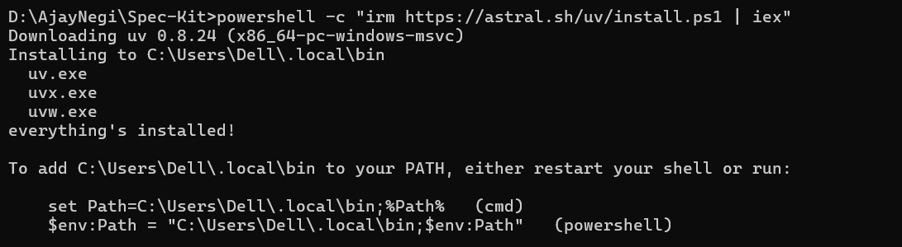
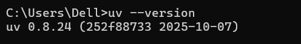
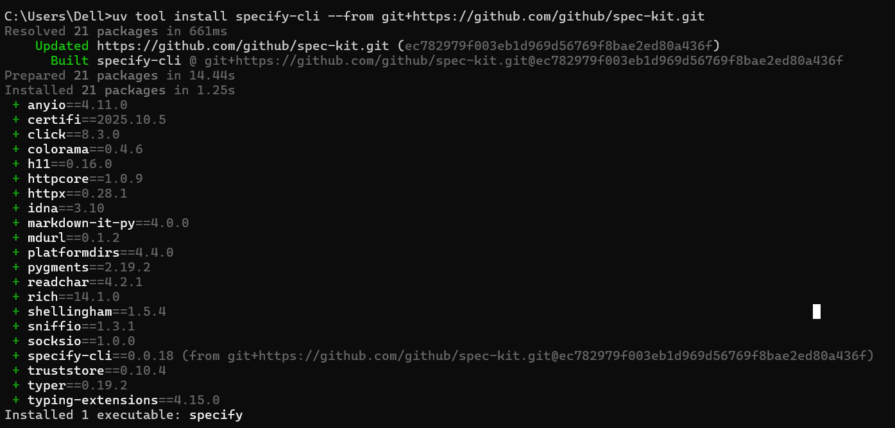
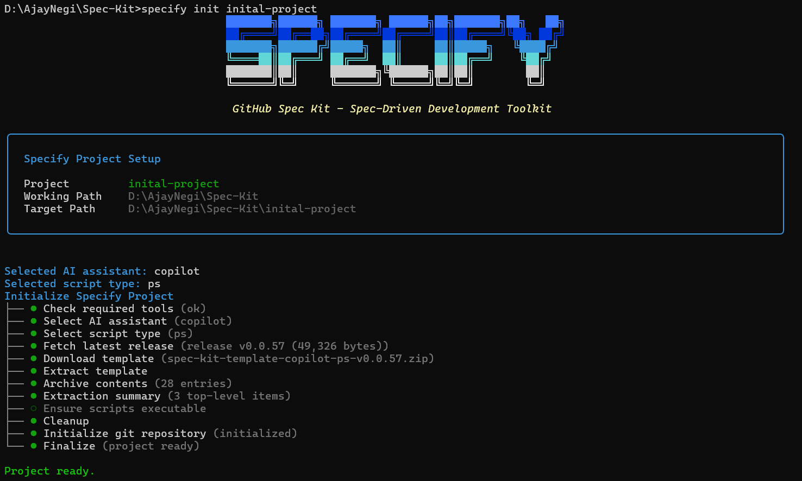
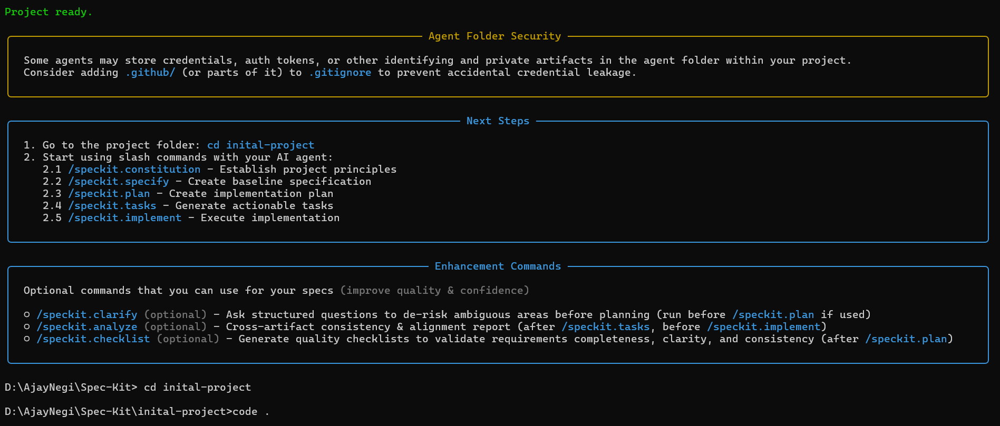
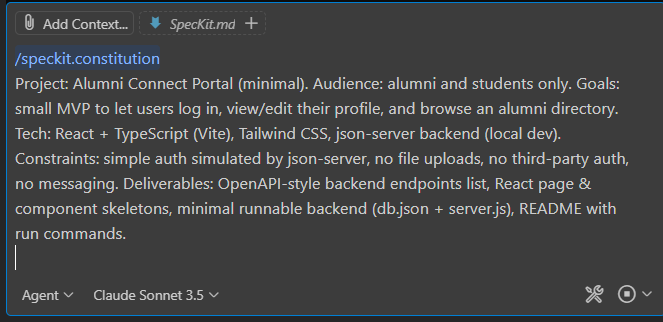
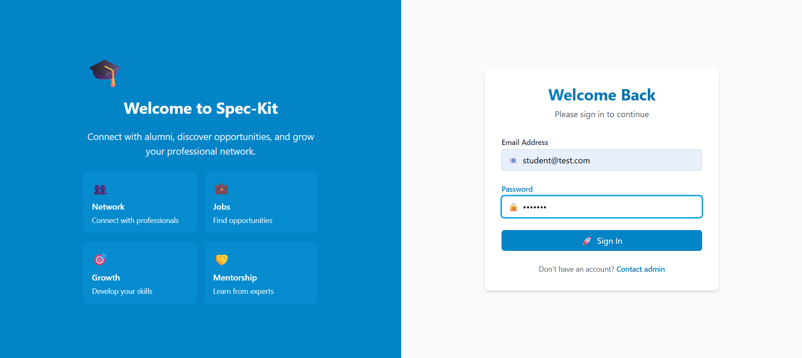
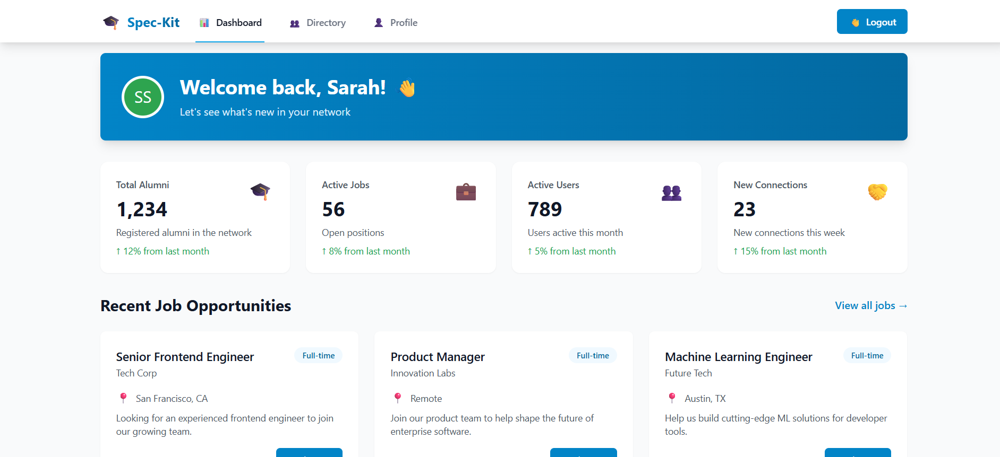
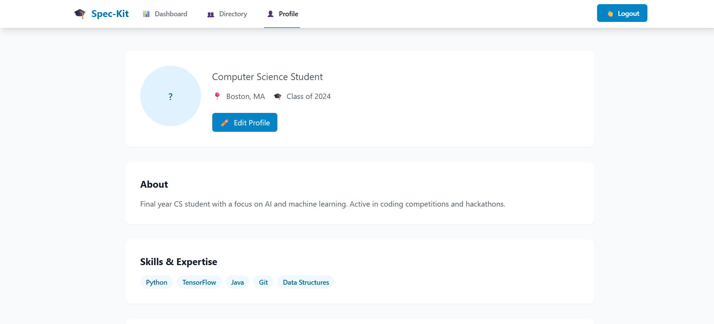

# Spec Kit 

### 1. Introduction

If you’ve ever used AI tools like ChatGPT, Claude, or Cursor to “build an app,” you know the pain: the AI generates hundreds of lines of code in minutes, but the moment you add something like user authentication, half your code gets rewritten. Your architectural choices live in chat logs that are hard to track, and six months later, you stare at your own code wondering why you made certain decisions.

Welcome to **vibe coding** — a chaotic world where every AI conversation is a fresh start.

**Spec Kit** is designed to solve this problem. It brings **structure, consistency, and clarity** to your code development by creating a **single source of truth** for your API specifications.

---

### 2.  Problem Spec Kit Solves

When developers “vibe code” or rely on AI suggestions, they face several issues:

* **Lost Intent:** It’s easy to forget why certain frameworks or structures were chosen.
* **Inconsistent Quality:** Different AI outputs lead to multiple approaches to the same problem.
* **Maintenance Nightmares:** Important knowledge exists only in chat histories or scattered files.
* **Team Coordination Issues:** Onboarding new developers becomes hard when intent and design are unclear.
* **Production Readiness Gap:** Demo or AI-generated code often fails in real-world scenarios.

Spec Kit addresses these issues by providing a **clear, shared specification** that the team can follow.

---

### 3. What is Spec Kit? (Definition)

**Spec Kit** is a tool that helps developers **create, manage, and validate API specifications**.

It ensures that:

* Your **API documentation** is consistent with your code.
* All **team members** understand the intended behavior of the APIs.
* Your project maintains **high-quality standards** even when using AI-generated code.

In short, **Spec Kit is a rulebook for your APIs**, making sure your implementation follows a defined plan.

---

### 4. How Spec Kit Works

1. **Define Your API:** Write a specification in JSON or YAML format describing endpoints, requests, and responses.
2. **Validate Your Implementation:** Spec Kit checks if your backend matches the defined spec.
3. **Generate Documentation:** Automatically creates API docs for your team.
4. **Mock APIs:** You can test the API before the backend is fully implemented.
5. **Maintain Consistency:** Every team member can rely on the spec as the single source of truth.

---


### 5. Installation

Getting started with Spec Kit is simple and **doesn’t require DevOps expertise**. It works on **Linux, macOS, and WSL2 on Windows**.

---

#### What You Need First

Before installing, make sure you have:

* **Git** – for repository management
* **Python 3.11+** – for running the tools
* **uv** – a package manager to install Spec Kit CLI
* **One AI coding agent** – GitHub Copilot, Claude Code, or Gemini CLI

---

#### Installation Commands

1. **Install `uv` using official installer (recommended for Windows):**

```powershell
powershell -c "irm https://astral.sh/uv/install.ps1 | iex"
```

* Downloads and installs `uv` to `C:\Users\<YourUser>\.local\bin`.
* You will see something like:



---

### 2. Verify `uv` Installation  

Before installing Spec Kit CLI, make sure `uv` is installed and available globally:  

```bash
uv --version
```

- Expected output:  



- This confirms that `uv` is correctly installed and ready to use.  

---

### 3. Install Spec Kit CLI  

Use the following command to install the Spec Kit CLI from GitHub:  

```bash
uv tool install specify-cli --from git+https://github.com/github/spec-kit.git
```

- During installation, `uv` will resolve and install all required packages.  
- Example packages installed: `anyio`, `click`, `colorama`, `httpx`, `rich`, `specify-cli`, and more.  
- At the end, `specify` executable will be available globally.  



---

### 4. Initialize a Spec Kit Project

After installing the CLI, you can **create a new Spec Kit project** using the `specify init` command:

```bash
specify init inital-project
```

* This command sets up a new project called `inital-project`.

* During initialization, the CLI will:

  * Check required tools
  * Let you select an AI assistant (e.g., Copilot)
  * Choose the script type (PowerShell, Bash, etc.)
  * Download and extract the project template
  * Initialize a Git repository
  * Prepare the project folder for development

* At the end, you will see a confirmation like:

```
Project ready.
```




---

### 5. Next Steps

Once the project is initialized, you can:

1. Go to the project folder:

```bash
cd inital-project
```

2. Start using **slash commands** with your AI agent:

| Command                 | Purpose                       |
| ----------------------- | ----------------------------- |
| `/speckit.constitution` | Establish project principles  |
| `/speckit.specify`      | Create baseline specification |
| `/speckit.plan`         | Create implementation plan    |
| `/speckit.tasks`        | Generate actionable tasks     |
| `/speckit.implement`    | Execute implementation        |

---





---


##  Spec Kit Workflow: 4 Phases

After opening the project in VS Code, a Spec Kit project typically follows **4 main phases** to scaffold, plan, and implement your application. Here’s what each phase does:

---
### Note: Run each Spec Kit command in agent mode so the AI can automatically create all necessary files.

Command order:
```
/speckit.constitution → /speckit.specify → /speckit.plan → /speckit.tasks → /speckit.implement
```

**Example:**


---

### **Phase 1: Constitution**

**Command:** `/speckit.constitution`

**Description:**

* This phase creates or modifies the `constitution.md` file according to project requirements.
* You define **project goals, audience, constraints, and deliverables**.
* Example for a web Alumni Connect Portal: minimal MVP, audience = alumni & students, tech stack = React + TypeScript (Vite), Tailwind CSS, json-server backend.
* After running this command, Spec Kit collects all **initial requirements** and sets up the **project principles**.

**Output:**

* `constitution.md` file
* Project structure initialized for the selected AI assistant and script type

**Example**


```
/speckit.constitution
Project: Alumni Connect Portal (minimal). Audience: alumni and students only. Goals: small MVP to let users log in, view/edit their profile, and browse an alumni directory. Tech: React + TypeScript (Vite), Tailwind CSS, json-server backend (local dev). Constraints: simple auth simulated by json-server, no file uploads, no third-party auth, no messaging. Deliverables: OpenAPI-style backend endpoints list, React page & component skeletons, minimal runnable backend (db.json + server.js), README with run commands.

```


---

### **Phase 2: Specify**

**Command:** `/speckit.specify`

**Description:**

* Generates a **baseline API + UI specification** in `spec.md`.
* You define:

  * **API endpoints** (e.g., POST /auth/login, GET /profiles/{id})
  * **Data schemas** (User, Profile, Job)
  * **UI components** (Login page, Dashboard, Alumni Directory, Profile page, Jobs list)
* This phase ensures your project has a clear **specification to follow** before implementing code.

**Output:**

* `spec.md` containing all API, schema, and UI component details

**Example**

```
/speckit.specify
Create a baseline API + UI specification. Provide:

API endpoints:
POST /auth/login
POST /auth/logout
GET /users
GET /profiles
GET /profiles/{id}
PUT /profiles/{id}
GET /jobs
GET /jobs/{id}

Schemas:
User { id, name, email, role: "student"|"alumni", password }
Profile { id, userId, headline, bio, graduationYear, company, location }
Job { id, title, company, description, postedByUserId }

UI screens/components:
- Login page (email, password)
- Dashboard (welcome + quick links)
- Alumni Directory (search, list of ProfileCards)
- Profile page (view & edit own profile)
- Jobs list page (read-only)
Return a minimal OpenAPI 3.0 fragment for the auth endpoints and the schema definitions.

```

---

### **Phase 3: Plan**

**Command:** `/speckit.plan`

**Description:**

* Creates a **detailed implementation plan** with milestones and low-level steps.
* Includes **tech stack description**, setup instructions, and stepwise tasks for frontend and backend development.
* Example steps for Alumni Connect Portal:

  1. Scaffold Vite React + TypeScript project
  2. Add Tailwind and base styling
  3. Setup routing and pages
  4. Implement backend auth (login/logout)
  5. Implement frontend pages (Login, Directory, Profile, Dashboard)
  6. Connect frontend to backend
  7. Add README and run scripts
* Small time blocks (0.5–4 hours) are suggested for each task.

**Output:**

* `plan.md` (implementation plan)
* `research.md` (technical decisions and rationale)
* `data-model.md` (data structures and relationships)
* `quickstart.md` (setup guide)
* `contracts/openapi.yaml` (API specification)

**Example**

```
/speckit.plan
Create an implementation plan with milestones and low-level steps:
1. Scaffold Vite React + TypeScript project
2. Add Tailwind and base styling
3. Setup routing and pages
4. Implement auth service (login/logout) using json-server endpoints
5. Create backend db.json and server.js with login/logout logic
6. Implement UI: Login, Directory, Profile (view/edit), Dashboard
7. Connect frontend to backend, add simple protected-route logic
8. Add README and run scripts
```

---

### **Phase 4: Tasks & Implement**

**Command:** `/speckit.tasks` and `/speckit.implement`

**Description:**

* **Tasks phase (`/speckit.tasks`)**:

  * Generates concrete, actionable tasks for the first sprint with **acceptance criteria** and expected file outputs.
  * Example tasks: setup project, add Tailwind, implement backend endpoints, implement login & profile pages, connect frontend to backend.
  * Creates `tasks.md`.

* **Implement phase (`/speckit.implement`)**:

  * Generates **minimal runnable skeletons** and **code templates** for frontend and backend.
  * Includes configuration files, routes, page components, service files, backend server, and README with exact run commands.
  * The output is a **ready-to-run MVP** with minimal, typed, and structured code.

**Output:**

* `tasks.md`
* Frontend and backend skeleton files
* README with run instructions

**Example**

**Tasks**

```
/speckit.tasks
Generate concrete actionable tasks with acceptance criteria and file names for the first sprint:
- Setup Vite project (acceptance: app runs at http://localhost:5173)
- Add Tailwind (acceptance: Tailwind classes apply)
- Create backend (db.json + server.js) with endpoints (acceptance: POST /auth/login returns token)
- Implement Login page (acceptance: login stores token and navigates to Dashboard)
- Implement Alumni Directory (fetch /profiles and display list)
- Implement Profile page (GET /profiles/:id and PUT to save changes)
Return tasks with expected files (e.g., src/pages/Login.tsx, backend/server.js).

```


**Implement**

```
/speckit.implement
Generate minimal runnable skeletons and code templates for:
- package.json scripts
- tailwind config & index.css
- src/App.tsx with routes
- src/pages/Login.tsx, Dashboard.tsx, Directory.tsx, Profile.tsx
- src/services/auth.ts and src/services/profile.ts
- backend/db.json example and backend/server.js with /auth/login and /auth/logout
Include README with exact commands to run frontend and backend.
Keep code minimal, typed, and ready to run.

```


# Final Output




---




---




---
