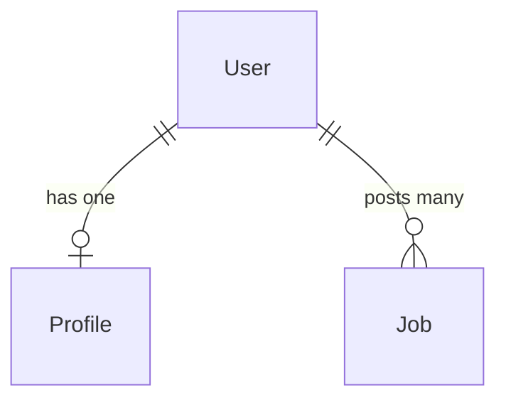

# Data Models

## User

```typescript
interface User {
  id: string;          // UUID
  name: string;        // Full name
  email: string;       // Email address (used for login)
  role: 'student' | 'alumni';  // User role
  password: string;    // Hashed password
}
```

**Validation Rules**:
- Email must be valid format
- Name cannot be empty
- Password must be at least 8 characters
- Role must be either 'student' or 'alumni'

## Profile

```typescript
interface Profile {
  id: string;          // UUID
  userId: string;      // Reference to User
  headline: string;    // Professional headline
  bio: string;        // About me
  graduationYear: number;  // Year of graduation
  company?: string;    // Current company (optional)
  location?: string;   // Current location (optional)
}
```

**Validation Rules**:
- UserId must reference valid User
- Headline max length: 100 chars
- Bio max length: 500 chars
- GraduationYear must be valid year between 1900 and current year + 5

## Job

```typescript
interface Job {
  id: string;          // UUID
  title: string;       // Job title
  company: string;     // Company name
  description: string; // Job description
  postedByUserId: string;  // Reference to User (alumni)
}
```

**Validation Rules**:
- Title cannot be empty
- Company cannot be empty
- Description max length: 2000 chars
- PostedByUserId must reference valid User with role 'alumni'

## Relationships



## State Transitions

### User
- Creation: Admin only (not in MVP)
- Update: Self only (name, email, password)
- No deletion in MVP

### Profile
- Creation: Automatic on user creation
- Update: Self only
- No deletion (tied to user)

### Job
- Creation: Not in MVP (read-only)
- Update: Not in MVP
- No deletion in MVP